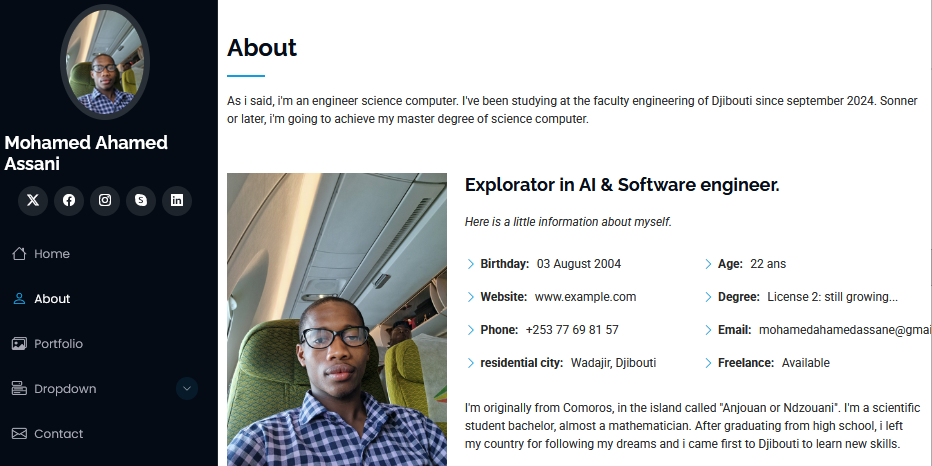
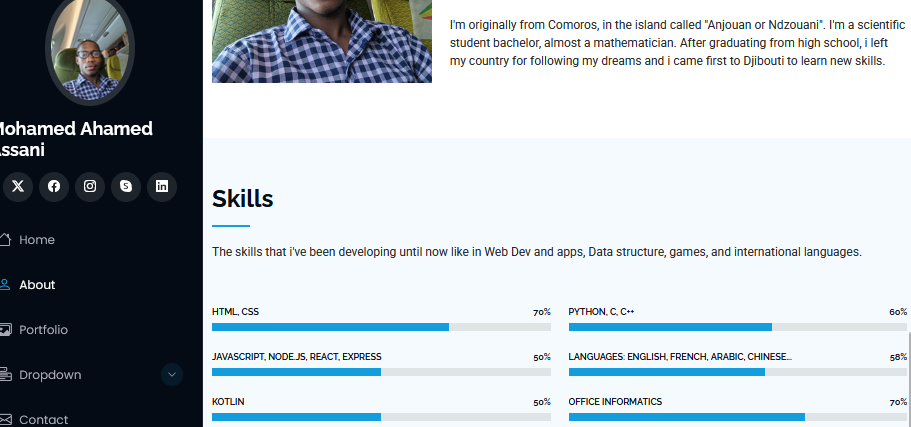
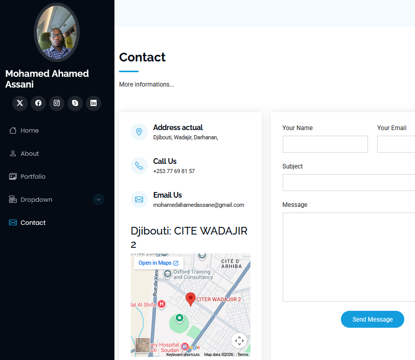

# First Website

## Description
A personal portfolio site for **Mohamed Ahamed Assani** built from the **iPortfolio** Bootstrap template. Static HTML, CSS, JavaScript, and assets ready to publish on GitHub Pages.

### The navigation


### The page home


### The page about



### The page portfolio


### The page contact


## Features
- **Sections:** Home, About, Skills, Portfolio, Contact  
- **Responsive layout** with animations (AOS, Typed.js, Swiper, Isotope, GLightbox)  
- **Animated skill progress bars** and portfolio lightbox    
- **Accessibility basics**: progress bars including `aria-valuenow`; images including `alt` attributes

- ## Chatbot
- The chatbot can chat automatically based on data and informations.

## Quick Start

### Clone the repository
```bash
git clone https://github.com/YOUR_GITHUB_USERNAME/first-website.git
cd first-website
```

### Edit files
- **HTML:** `index.html`  
- **CSS:** `assets/css/main.css`  
- **JavaScript:** `assets/js/main.js`  
- **Images and media:** `assets/img/` and `assets/img/portfolio/`

## Deploy to GitHub Pages

### Push to GitHub
```bash
git add .
git commit -m "Publish portfolio"
git push origin main
```

### Enable Pages
On GitHub go to **Settings → Pages**, set **Branch** to `main` and **Folder** to `/ (root)`, then **Save**.  
Public URL:
```
https://YOUR_GITHUB_USERNAME.github.io/first-website/
```

## Important Notes for Static Hosting

### Contact form
GitHub Pages does not run server-side code. Replace the form action `forms/contact.php` with a static form provider such as **Formspree**, **Getform**, or **Netlify Forms**.

**Formspree example**
```html
<form action="https://formspree.io/f/YOUR_FORM_ID" method="POST" class="php-email-form">
  <!-- keep inputs the same -->
</form>
```

### Large media
Host large videos externally (YouTube or Vimeo) and embed them to avoid repository size limits and improve performance.

**Embed example**
```html
<div class="video-wrapper">
  <iframe src="https://www.youtube.com/embed/VIDEO_ID" title="Portfolio video" frameborder="0" allowfullscreen loading="lazy"></iframe>
</div>
```

**Responsive CSS**
```css
.video-wrapper { position: relative; padding-bottom: 56.25%; height: 0; overflow: hidden; }
.video-wrapper iframe { position: absolute; top:0; left:0; width:100%; height:100%; border:0; }
```

### Asset paths
GitHub Pages is case sensitive. Ensure filenames and paths match exactly.

## Accessibility Checklist
- Add meaningful `alt` text to all images  
- Add `aria-expanded` to the mobile menu toggle and keyboard support for dropdowns  
- Ensure form fields have associated `<label>` elements  
- Verify color contrast for readability

## Performance Recommendations
- Add `&display=swap` to Google Fonts links  
- Compress images and use WebP where possible  
- Use `defer` on vendor scripts and `assets/js/main.js` to avoid DOM timing errors  
- Replace local videos with external embeds

## Troubleshooting
- If animations or widgets fail, verify vendor scripts are present and loaded before `assets/js/main.js`  
- If progress bars do not animate, confirm `aria-valuenow` attributes and that Waypoint or scroll code runs  
- If images are missing, check exact filename case and relative paths

## Credits
- **Template:** iPortfolio by BootstrapMade  
- **Owner:** Mohamed Ahamed Assani

## Contact
**Email:** mohamedahamedassane@gmail.com

## License
This project is licensed under the MIT License — see the LICENSE file in this repository for details.

Note: the iPortfolio template is provided by BootstrapMade and may include its own license or attribution requirements. 
Including an MIT LICENSE file in this repository applies to your project files.
keep the original template attribution as required by the template provider.
